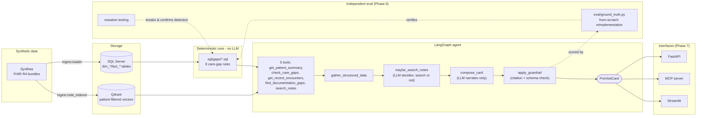

# Pre-Visit Clinical Intelligence Agent

[](https://github.com/Vaishnavi-K23/Previsit-agent-/actions/workflows/ci.yml)


**⚠️ Synthetic data only.** Every patient record used by this project is generated by [Synthea](https://github.com/synthetichealth/synthea), MITRE's synthetic patient generator. No real patient data is used, stored, or connected to at any point. This is a portfolio/demonstration project, not a clinical system - see [Synthetic data](#synthetic-data) and [Known limitations](#known-limitations) before drawing any conclusion from it about real clinical use.

The agent generates a citation-backed pre-visit summary for a clinician about to see a patient - active care gaps, documentation gaps, and recent encounters, each claim traceable to the exact record it came from. It exists because an LLM-generated clinical summary is only as trustworthy as its weakest uncited claim, and most demos never actually test whether that claim holds under an independent audit. Every deterministic decision (is a screening overdue, is a lab uncontrolled) is made by SQL before the LLM ever sees the patient, and the whole pipeline - rules, retrieval, and the agent's own hallucination rate - was evaluated against ground truth re-implemented from scratch, not the same code checking itself.

**Skills demonstrated:** LLM agent orchestration (LangGraph, multi-step tool-calling graphs) · prompt engineering with a citation/hallucination guardrail · independent evaluation design (ground truth re-implemented from scratch, mutation testing, deterministic-vs-agent-level metric separation) · relational + vector data modeling (SQL Server, Qdrant) · FastAPI, MCP server, and Streamlit interfaces over one shared agent · MLflow experiment tracking · Docker Compose local infra with a documented Azure production mapping · CI (GitHub Actions: lint, test, end-to-end smoke test).

Built with Claude Code from a spec I wrote (`SPEC.md`). I defined the phase gates and acceptance checks and drove the validation work throughout; implementation was agent-assisted.

## Eval results (above the fold - full detail in [docs/EVAL_RESULTS.md](docs/EVAL_RESULTS.md))

Two tables, deliberately kept separate: gap recall/precision are a property of the deterministic SQL engine and cost nothing to measure at full population scale; hallucination rate, schema violations, and latency require a live LLM call and are rate-limited by free-tier quotas. Conflating them into one number would either hide the free eval behind the expensive one, or let the expensive one borrow the free one's scale.

**Deterministic (no LLM calls, full population, free to re-run)**

| Metric | Value |
|---|---|
| Patients | 1,175 (1,000 living + 175 deceased) |
| Gap recall | 100.0% (576/576) |
| Gap precision | 100.0% (576/576) |
| Exact gap-set agreement | 100.0% (1,175/1,175 patients) |
| Discrepancies | 0 |
| Mutation testing | 3 mutations tested; 2 caught, 1 provably a no-op on this dataset (see [below](#what-validation-uncovered)) |

**Agent-level (live LLM calls, accumulates via `--resume` across multiple days)**

| Metric | Value |
|---|---|
| Patients completed (primary accumulation, pinned `gemini-3.6-flash`) | 1 of a ≥100 target - **actively accumulating, not a finished number** |
| Hallucination rate | 0.0% (0/3 findings) |
| Schema violation rate | 0.0% (0/3 findings) |
| Citation validity | 100.0% |
| Patient leakage | 0 |
| Latency p50 / p95 | 38.0s / 38.0s |

Free-tier daily caps (Gemini: 20 requests/day; Groq: 200,000 tokens/day, ~8-15 patients through this multi-call agent) make ≥100 patients impossible in a single day on any provider tried. `eval/run_eval.py --resume` checkpoints every patient immediately on completion and resumes across days without re-spending quota on one that already succeeded - this is a deliberate, documented constraint of free-tier infrastructure, not a number being quietly padded. `docs/EVAL_RESULTS.md` also shows two smaller cross-model validation runs (Gemini, n=5; Groq `openai/gpt-oss-120b`, n=2 and a historical n=8) kept as permanent, separately-labeled rows specifically because two independent models hitting the same failure mode is real evidence - see the next section.

## What validation uncovered

The eval work on this project surfaced four findings worth reading as the substantive output of the project, not an appendix to it.

The diabetic cohort definition - which gates four of the eight care-gap rules - was wrong at first, and an independent audit caught it the same way a real analyst would: by checking the result against an expected population rate rather than trusting the query because it ran without error. The naive definition (an active SNOMED `44054006` diagnosis, and nothing else) produced 81 diabetic patients out of 1,000 living patients, 8.1% - below the 10-15% prevalence expected for this kind of synthetic population. Auditing the gap found 84 additional patients (61 living) carrying an active diabetes-complication code - kidney disease, microalbuminuria, retinopathy, neuropathy, proteinuria - with no base diagnosis row at all anywhere in their record; Synthea's diabetes module doesn't always separately emit the base diagnosis alongside a complication. After checking first for type-1 contamination (there is none in this dataset) and explicitly excluding prediabetes (a distinct SNOMED code carried by 475 patients, and clinically not the same treatment population), broadening the cohort definition to include those complication codes plus active insulin brought the count to 142 living patients, 14.2% - inside the expected range. The naive definition had been missing 43% of the true diabetic cohort (61 of 142), silently, from a query that returned a plausible-looking number and never threw an error. The fix and the full code list live in `docs/CARE_GAP_RULES.md` and `src/previsit/gaps/definitions.py`.

The original design for `find_documentation_gaps` - find a condition mentioned in a note's free text but missing from the coded problem list - turned out to be circular by construction on this dataset, and the reason is structural rather than a data-quality accident. Synthea's `DocumentReference` notes render a `History of Present Illness` section as a direct prose restatement of the patient's already-coded condition list (`"Patient has a history of gingival disease (disorder), chronic kidney disease stage 3 (disorder), ..."`) - every condition named in that sentence is drawn from the same `fact_condition` rows the tool would be checking it against. Scanning the HPI for "mentioned but not coded" conditions can only ever produce a null result, which would read to a clinician as false reassurance rather than an honest absence of signal. A corpus-wide check across all 73,448 notes confirmed this wasn't a sampling artifact: 94.2% of all note text recurs verbatim in two or more other notes, and even at a strict bar (a line has to appear in 5,000+ separate notes), 36.0% of all text is exact boilerplate. The tool was redesigned around the one part of these notes that carries independent information - the structured `Chief Complaint` bullet list - checking whether a symptom charted repeatedly (e.g. "Tingling in Hands and Feet," ≥2 distinct notes) for a diabetic patient ever gets a corresponding condition coded, rather than scanning prose that was never independent of the coded list to begin with. Full writeup in `docs/ARCHITECTURE.md`.

The agent's citation guardrail correctly rejected an out-of-enum `severity` value (the model writing `'moderate'` or `'info'` instead of the schema's exact `high`/`medium`/`low`) on **two unrelated models** - `gemini-3.6-flash` and Groq's `openai/gpt-oss-120b` - which is convergent evidence the prompt's instructions were underspecified, not that either model is uniquely unreliable. That distinction only became visible after separating **schema violations** (a real, correctly-cited claim that fails to parse into the output schema) from **hallucinations** (an uncited or fabricated claim) as two different metrics; conflating them, as the eval harness originally did, would have reported a 14.3% "hallucination rate" for a run that had zero actual hallucinations. The fix closed the loop on two layers - the prompt now states the exact three allowed values with concrete mapping guidance, and the guardrail normalizes known near-miss synonyms (`info` → `low`, `moderate` → `medium`) before validation, logging every correction rather than silently accepting or rejecting. A post-fix spot check on Groq (n=2, small enough to be a signal rather than a proof) showed zero corrections needed. See `docs/EVAL_RESULTS.md`'s "Closing the severity loop" note.

A 100% agreement result between the SQL engine and the independently re-implemented ground truth is only meaningful evidence if a broken engine would actually score below 100% - so the deterministic eval was mutation-tested: three deliberate, targeted breaks introduced one at a time into real `sql/gaps/*.sql` files, each reverted (verified byte-for-byte) before the next ran. Narrowing a 12-month lookback window to 11 months produced 3 discrepancies; flipping a threshold comparison operator (`>=` to `<`) on the blood-pressure rule produced 160 - a much larger blast radius, as expected for inverting an entire rule's polarity. The third mutation - dropping one SNOMED code from a rule's diabetic-cohort list - produced **zero** discrepancies, and that result was investigated rather than quietly counted as a pass: it turned out 0 patients in this dataset carry that specific code as their *sole* diabetes-qualifying evidence, so removing it from one rule's list is provably a no-op for this population - a dataset-redundancy artifact, not a gap in the check's sensitivity. Reporting a mutation that couldn't have changed the output, and explaining precisely why, is the same discipline as reporting the ones that did: a null result from a well-understood cause is evidence, not something to omit because it isn't a "win." Full results in `docs/EVAL_RESULTS.md`'s mutation-testing section.

## Quickstart

Clone to a running demo in under 10 commands. Requires Docker Desktop (WSL2 backend on Windows) and Python 3.11+.

```bash
cp .env.example .env
# edit .env: set MSSQL_SA_PASSWORD (8+ chars, upper+lower+digit/symbol),
# and GEMINI_API_KEY (free at https://aistudio.google.com/apikey)

docker compose up -d
python -m venv .venv && .venv\Scripts\activate     # Windows; use source .venv/bin/activate on macOS/Linux
pip install -e ".[dev]"
python -m previsit.healthcheck                     # expect [OK] for SQL Server and Qdrant

python -m previsit.ingest.synthea_runner            # generates ~1,000 synthetic patients (one-time, takes a while)
python -m previsit.ingest.loader                    # loads FHIR bundles into SQL Server
python -m previsit.ingest.note_indexer              # chunks + embeds notes into Qdrant

streamlit run src/previsit/streamlit_app.py         # pick a patient, generate a card, expand a citation
```

### MCP server setup

The same five deterministic tools the agent uses are directly callable from Claude Code, Cursor, or any MCP client - no LLM reasoning happens in this process, it's the identical SQL/Qdrant retrieval.

```bash
python -m previsit.mcp_server.server          # run standalone to confirm it starts
claude mcp add previsit-agent -- python -m previsit.mcp_server.server   # add to Claude Code
```

For Cursor or another `mcp.json`-based client:

```json
{
  "mcpServers": {
    "previsit-agent": {
      "command": "python",
      "args": ["-m", "previsit.mcp_server.server"],
      "cwd": "/absolute/path/to/this/repo"
    }
  }
}
```

### FastAPI

```bash
uvicorn previsit.api.main:app --reload
```

`GET /health`, `GET /patients`, `GET /patients/{id}/card`, `POST /patients/{id}/card/refresh` - interactive docs at http://127.0.0.1:8000/docs.

## Architecture



**EHR portability.** `previsit.ingest.fhir_parser` parses standard FHIR R4 resource JSON (`Patient`, `Condition`, `Observation`, `MedicationRequest`, `Encounter`, `Procedure`, `DiagnosticReport`, `Immunization`, `DocumentReference`) - the same resource shapes a real EHR's FHIR API returns, not a Synthea-specific format. A real deployment would swap `previsit.ingest.synthea_runner` and the local-file bundle loader in `previsit.ingest.loader` for a FHIR REST API client against a live endpoint; the per-resource field extraction in `fhir_parser.py` is the part that's reusable, not the "read a local JSON file" mechanism around it. The relational layer's `dim_*`/`fact_*` star-schema tables map conceptually onto the same kind of dimensional model Epic's Clarity and Caboodle reporting databases use for patients, diagnoses, and encounters. To be precise about what this claim is and isn't: the resource model transfers - **no live FHIR endpoint or real EHR has been integrated with this project**, and that would be real, untested integration work, not a configuration change.

## Stack, and its Azure production equivalent

Every component here is free and requires no account or credit card. The right column is what each would become in a real deployment - the agent code itself (LangGraph, the provider abstraction in `previsit.llm`) doesn't change, only which infrastructure it's pointed at.

| Component | This project (free, local) | Azure production equivalent |
|---|---|---|
| Relational DB | SQL Server 2022 Developer (Docker) | Azure SQL Database |
| Vector store | Qdrant (Docker) | Azure AI Search (vector) or Cosmos DB for MongoDB vCore |
| Embeddings | `sentence-transformers/all-MiniLM-L6-v2` (local CPU) | Azure OpenAI `text-embedding-3-small` |
| LLM | Gemini 3.6 Flash (pinned) / Groq (eval-only, see limitations) | Azure OpenAI Service - already wired via `previsit.llm.azure_openai`, a one-line `LLM_PROVIDER=azure` switch |
| Agent orchestration | LangGraph | Unchanged - provider-agnostic |
| API | FastAPI + Uvicorn | Azure Container Apps / App Service |
| MCP server | `mcp[cli]`, stdio transport | Azure Container Apps (SSE/streamable-HTTP transport) |
| Demo UI | Streamlit | Azure App Service or Static Web Apps |
| Experiment tracking | MLflow (SQLite-backed) | Azure Machine Learning (managed MLflow) |
| Container orchestration | Docker Compose | Azure Container Apps / AKS |
| Synthetic data generation | Synthea (local JAR, GitHub release) | N/A - production would connect to a real EHR via FHIR, not generate data |

## Synthetic data

Every patient, condition, encounter, note, and lab value in this project comes from [Synthea](https://github.com/synthetichealth/synthea), an open-source synthetic patient generator built by MITRE specifically so tools like this can be built and evaluated without touching real PHI. Nothing in `data/synthea_output/` (gitignored, regenerated locally by `python -m previsit.ingest.synthea_runner`) is, or is derived from, a real person's medical record. See `docs/SAFETY_AND_PRIVACY.md` for the full safety and privacy design, including why this same architecture keeps no real PHI reaching an external inference endpoint even in a production deployment.

## Known limitations

**Agent-level latency (38-78s p50/p95 depending on provider) is too slow for point-of-care use.** A clinician pulling up a chart shouldn't wait over a minute for a card to render. A production design would render the deterministic care gaps immediately - they're a plain SQL query, no LLM latency at all - and fill in the LLM-generated narrative and one-line summary asynchronously once it's ready, rather than blocking the whole card on the slowest part of the pipeline. This project doesn't implement that split; it's a real limitation of the current design, not a hypothetical one, evidenced directly in `docs/EVAL_RESULTS.md`.

**The agent-level eval's sample size (n=1 in the primary accumulation as of this writing) is genuinely small, and is constrained by infrastructure, not by choice.** Every free-tier LLM provider tried caps out far below the ≥100-patient target this project specified for itself: Gemini's free tier allows 20 requests/day total (not just for this project - for everything using that API key), and Groq's `openai/gpt-oss-120b` caps at 200,000 tokens/day, which this multi-call agent burns through in roughly 8-15 patients. `eval/run_eval.py --resume` exists specifically to accumulate past this over multiple days without re-spending quota, but as of this writing that accumulation has only reached n=1 on the pinned model. The two cross-model spot checks (Gemini n=5, Groq n=2 and a historical n=8) shown separately in `docs/EVAL_RESULTS.md` are real data, correctly labeled as supplementary rather than primary evidence, and should be read as "consistent with the fix working," not "the fix is proven at scale." Treat every agent-level percentage in this project as directionally informative, not statistically powered, until that n grows.

**`A1C_UNCONTROLLED` cannot be evaluated as a positive case anywhere in the main 1,175-patient dataset.** Verified twice independently: only 3 patients in the entire population ever recorded an HbA1c ≥ 8.0% at all, and in every case the value was recorded once at initial diagnosis and never recurred at that level - Synthea's diabetes module generates this trajectory by design, not as a data-quality gap. A rule with zero true positives in its evaluation population can't have its recall or precision meaningfully measured against that population alone. `eval/fixtures/` contains a hand-built patient (an A1c of 9.2% recorded last month) specifically to prove the rule logic itself is correct - and it is, cross-checked against both the SQL engine and the independent ground truth with zero discrepancy - but that fixture is a unit test for the rule, not evidence the rule has ever fired on organic data, and the two should not be conflated.

**Synthea's note narrative has real, structural limitations for any tool built on top of it**, beyond the HPI-circularity finding described above. 94.2% of all note text across the 73,448-note corpus recurs verbatim across multiple notes, and the non-boilerplate remainder is overwhelmingly the same templated condition list and Social History sentences (`"Patient comes from a middle socioeconomic background."`), not free clinical prose a human wrote. `find_documentation_gaps`'s two shipped symptom→condition pairs were both verified against real patient counts before shipping, but one of them (recurring "Blurred Vision" without a coded retinopathy diagnosis) matches only 3 patients in the entire dataset - kept specifically to show the pattern generalizes beyond one hardcoded case, but it should be read as a much weaker signal than the neuropathy pair (12 patients), not equal evidence. A third candidate pair (a classic hyperglycemia symptom cluster, as a signal for possibly-undiagnosed diabetes) was checked and cut entirely: 78 of 80 candidate patients were already coded diabetic, meaning the tool would have mostly been re-confirming what was already known rather than surfacing a real gap.

**The diabetic cohort definition required an empirical correction once already** (see "What validation uncovered" above) and remains a hand-audited value set (`src/previsit/gaps/definitions.py`), not a canonical clinical terminology query - a future Synthea regeneration, or a real EHR's different coding patterns, could reintroduce a similar undercount that would need the same population-rate sanity check to catch. The statin medication list is a similarly hand-derived snapshot of codes actually present in one Synthea generation's formulary, not a general RxNorm statin-class lookup, and would need re-auditing against a new formulary the same way.

**The care-gap rules are guideline-inspired approximations of USPSTF/ADA/ACC-AHA guidance, not licensed HEDIS or NCQA measure specifications**, and are not validated for or intended for real clinical use. `docs/CARE_GAP_RULES.md` states this explicitly for every rule; it bears repeating here because it's the single most important caveat for anyone evaluating this project's clinical plausibility.

**The interactive agent is pinned to `gemini-3.6-flash`, deliberately, not the latest available model**, so results are comparable across the phases this project was built and evaluated in - `gemini-3.7-flash` exists as of this writing and was verified live (not inferred from an error message) before choosing not to switch. `LLM_MODEL` in `.env` is a one-line change. Groq was substituted for the eval harness only, on two separate occasions, purely because Gemini's free-tier daily request cap (20/day, shared across all usage of that key) makes a ≥100-patient run impossible in one sitting on any single day - this is an eval-only exception, documented in `docs/EVAL_RESULTS.md`, and the interactive agent never uses Groq by default.

**The in-process card cache (FastAPI, Streamlit) is a demo-scope choice, not a production one.** It's an in-memory dict with no persistence, no TTL, and no invalidation policy, lost on every restart. That's acceptable here because nothing cached is PHI and every card is trivially regenerable from source data - a real deployment would need a real cache/store with an actual policy. Similarly, neither the FastAPI nor the MCP server has any authentication - both are built for local demo use only and would need real access control before being exposed beyond localhost.

**Mutation testing has its own known gap.** One of the three deliberate SQL breaks (dropping a diabetes complication code) couldn't be detected on the current dataset because zero patients depend solely on that code - a real, if narrow, coverage gap in what mutation testing can currently prove, not a masked failure (see "What validation uncovered"). Closing it would mean adding a fixture patient whose only diabetes evidence is that one code, the same pattern already used for `A1C_UNCONTROLLED`.

## License

MIT
